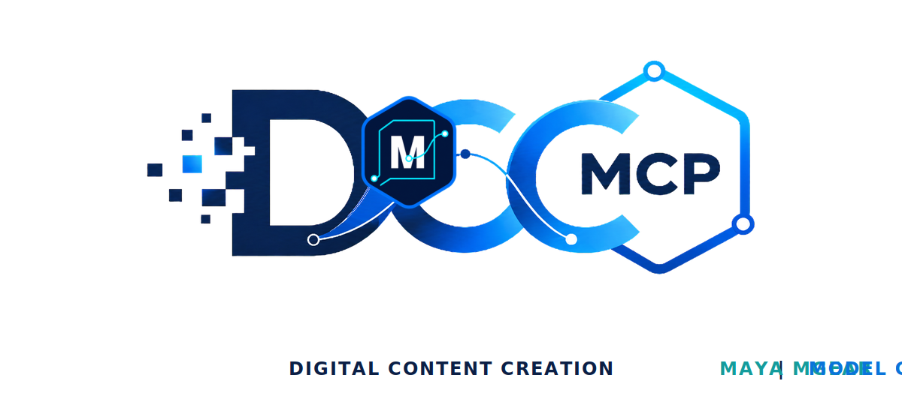
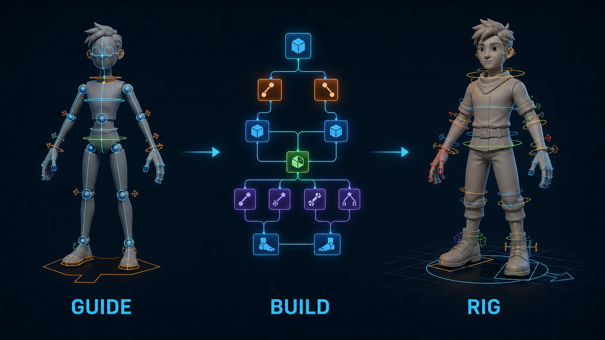

# dcc-mcp-maya-mgear

<p align="center">
  
</p>

## Agent workflow

AI agents should use the shared gateway through `dcc-mcp-cli`; IDE users may
continue to use the MCP endpoint. Prefer typed skills and tools over raw scripts.

### Install or update the CLI

`dcc-mcp-cli` is the preferred control path for every shell-capable agent. If
it is missing, ask the user before installing the latest official release:

```bash
# Linux/macOS
curl -fsSL https://raw.githubusercontent.com/dcc-mcp/dcc-mcp-core/main/scripts/install-cli.sh | sh

# Windows PowerShell
powershell -ExecutionPolicy Bypass -c "irm https://raw.githubusercontent.com/dcc-mcp/dcc-mcp-core/main/scripts/install-cli.ps1 | iex"
```

Keep an official build current through the release manifest:

```bash
dcc-mcp-cli update check
dcc-mcp-cli update apply
```

`update apply` downloads and stages the latest CLI for the next launch. It
does not update a running `dcc-mcp-server`; update that server in its own
environment.

```bash
dcc-mcp-cli dcc-types
dcc-mcp-cli list
dcc-mcp-cli search --query "<task>" --dcc-type maya
dcc-mcp-cli describe <tool-slug>
dcc-mcp-cli call <tool-slug> --json '{"key":"value"}'
```

`dcc-types` reports release-catalog support; `list` reports live sessions. If a
tool belongs to an inactive progressive skill, call `dcc-mcp-cli load-skill <skill-name> --dcc-type maya` before retrying. For post-task improvement,
attach a stable session id with `--meta-json`, query `dcc-mcp-cli stats --range 24h --session-id <task-id>`, then pass the bounded evidence to the
`review_skill_improvement` prompt from `dcc-mcp-skills-creator`.




[](https://github.com/dcc-mcp/marketplace)
[](https://github.com/dcc-mcp/dcc-mcp-maya)

mGear Shifter rigging integration for the DCC-MCP ecosystem — inspect mGear
environments, list Shifter components, create guides, build rigs, and export
templates through typed MCP tools.

## Repository Layout

```
skill/maya-mgear/               ← canonical installable skill package
├── SKILL.md
├── tools.yaml
├── metadata/depends.md
└── scripts/                    ← 6 mGear tools
skill/mgear-import-to-scene/    ← import-to-scene skill package
├── SKILL.md
├── tools.yaml
├── metadata/depends.md
└── scripts/                    ← 1 import tool

marketplace.json                ← marketplace catalog entry
icon.png                        ← marketplace icon
.github/workflows/              ← CI/CD
```

### Key Rules

- `skill/maya-mgear/` and `skill/mgear-import-to-scene/` are the **only** canonical paths for SKILL.md, tools.yaml,
  metadata/, and scripts/. No duplicates anywhere else.
- `marketplace.json` and `icon.png` live at the repo root — they are catalog
  metadata, not skill runtime files.

## Install

```bash
dcc-mcp marketplace install dcc-mcp-maya-mgear --dcc maya
```

Installed to `~/.dcc-mcp/marketplace/maya/dcc-mcp-maya-mgear/`. After install,
the skill is automatically registered with the running Maya adapter.

## Skills

| Skill | Tools | Description |
|-------|-------|-------------|
| `maya-mgear` | 6 | Inspect, list, create, build, export, and import mGear Shifter components |
| `mgear-import-to-scene` | 1 | Import mGear rigs into the Maya scene via an AssetDescriptor contract |

### Tools

#### maya-mgear

| Tool | Description |
|------|-------------|
| `inspect_mgear_environment` | Check mGear availability, version, and module diagnostics |
| `list_shifter_components` | List Shifter component types and scene guides |
| `create_shifter_guide_from_template` | Create a guide from a named template at a position |
| `build_shifter_rig` | Build a rig from an existing Shifter guide |
| `export_shifter_guide_template` | Export a guide or component as a reusable template |
| `import_shifter_sample_template` | Import an official sample template (e.g. quadruped.sgt) with structured metadata |

#### mgear-import-to-scene

| Tool | Description |
|------|-------------|
| `mgear_import_to_scene` | Import an mGear rig into the scene from a file path with optional loader configuration |

## Prerequisites

- Autodesk Maya 2022+
- [dcc-mcp-maya](https://github.com/dcc-mcp/dcc-mcp-maya) installed and configured
- [mGear Shifter](https://github.com/mgear-dev/mgear) installed and accessible from Maya
- dcc-mcp-core >= 0.18.2

## Related

- [DCC-MCP Marketplace](https://github.com/dcc-mcp/marketplace) — skill catalog
- [dcc-mcp-core](https://github.com/dcc-mcp/dcc-mcp-core) — runtime
- [dcc-mcp-maya](https://github.com/dcc-mcp/dcc-mcp-maya) — Maya adapter

## License

MIT
